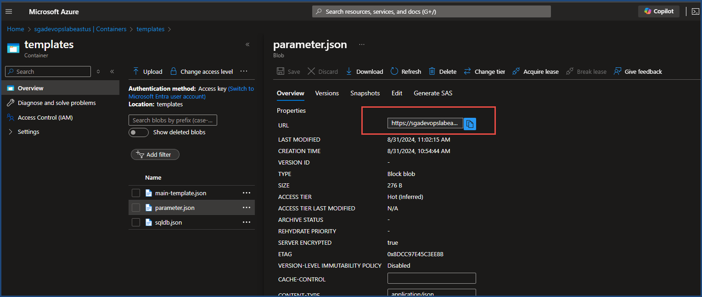

# Linked ARM Templates Overview

In this scenario, we are deploying an Azure WebApp on an App Service Plan. Following that, we create an MS SQL Server on Azure and a database. The `main-template.json` file defines the WebApp and App Service Plan. The database template and its parameter files are referenced via URIs within the resource block. When Azure Resource Manager (ARM) processes the deployment, it refers to these linked templates.

### Lab Deployment Steps

**Step 1:** Create a resource group in the desired region (e.g., `eastus2`).

**Step 2:** Create a Storage Account, either in the same or a different resource group. Ensure public access to Blobs from any network is enabled.

**Step 3:** Upload the `sqldb.json` and `parameter.json` files to the Storage Blob (Block Blob).

**Step 4:** 
1. Go to **Azure Portal** -> **Resource Group** -> Select the resource group.
2. Click **Create Resource** -> Search for **Deployment Custom Template**.
3. Use the **Template Editor** and paste the content from the `main-template.json` file.
4. Proceed with creating the resource.

### How It Works

The following code snippet links the database template and its parameter file:

```json
{
  "name": "linkedDeployment1",
  "type": "Microsoft.Resources/deployments",
  "apiVersion": "2024-03-01",
  "properties": {
    "mode": "Incremental",
    "templateLink": {
      "uri": "[variables('dbdeployment_template_url')]",
      "contentVersion": "1.0.0.0"
    },
    "parametersLink": {
      "uri": "[variables('dbparam_template_url')]",
      "contentVersion": "1.0.0.0"
    }
  }
}
```

Here, the `sqldb.json` and `parameter.json` files are uploaded to a Blob container named `templates` in an Azure Storage Account. Retrieve the URL as follows:

1. Go to **Azure Portal** -> **Storage Account** -> **Data Storage** -> **Containers** -> **templates**.
2. Get the Blob URL.



## Supported URI Sources for Linked ARM Templates

In Azure Resource Manager (ARM) templates, you can link to the following types of URI sources:

1. **Azure Blob Storage URI:**
   - ARM templates can reference templates stored in Azure Blob Storage. Ensure the blob has public access or use a SAS token for secure access.

2. **GitHub URI:**
   - You can link templates hosted on GitHub using raw content URLs. This allows ARM templates to pull files directly from a GitHub repository. This is link you get when refer to the RAW format in GitHub

3. **External Web URIs:**
   - Any publicly accessible URI can be used as long as the content is formatted correctly. For example, you can link templates hosted on external websites.

4. **Azure File Share URI:**
   - Templates stored in an Azure File Share can be linked using a URI, providing another option for storage.

5. **Private Repository with SAS Token:**
   - If using private storage, generate a Shared Access Signature (SAS) token and append it to the URI for secure access.

---
